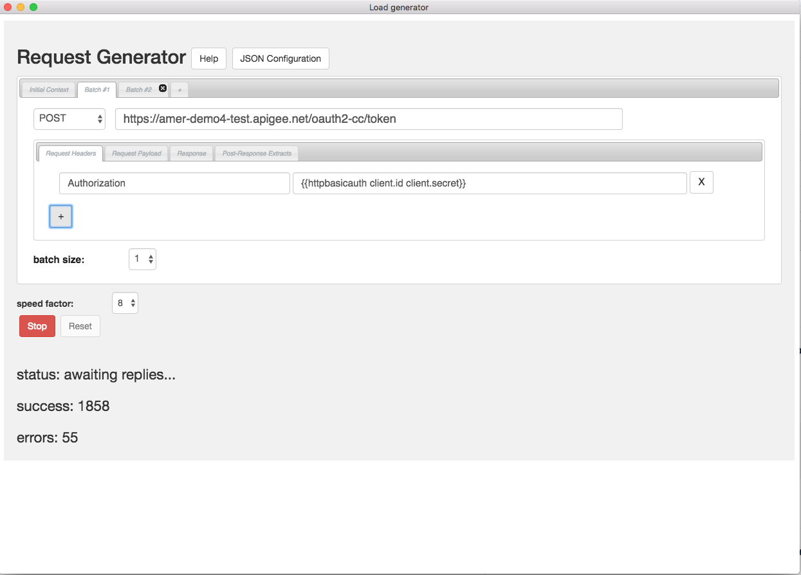

# Electronjs load-gen

This app will generate a stream of requests against one or more HTTP Endpoints, with parameters that you specify. This app works like [this web app](https://dinochiesa.github.io/load-generator/). The differences:

|                |  Web app          | Electronjs App         |
|----------------|-------------------|------------------------|
| installation   | none              | OS-native installer    |
| API endpoints  | must support CORS | any endpoint           |




## MacOS and Windows installers

- [MacOS](./installers/macos/electron-load-generator-0.9.2.dmg)
- [Windows](./installers/windows/LoadGeneratorAppInstaller-0.9.2.exe)


| File                                 | SHA256 hash  |
|--------------------------------------|--------------|
|electron-load-generator-0.9.2.dmg     | 0ece5f22084309bbf9fb609cc3d87f8190c6bd4ff5afbd39784baffd70dea8e6 |
|LoadGeneratorAppInstaller-0.9.2.exe   | ED050487C787B0C6CCA40D73B751D4B8A988AA4BBD98DFB82FAECF5E662BA43E |


## To Run from the Repo

You need to first clone the repo to your own local machine. Then:

```
npm install
npm start
```

## License

This material is copyright 2018 Google Inc.
and is licensed under the [Apache 2.0 License](LICENSE).

## Disclaimer

This tool is not an official Google product, nor is it part of an official Google product.


## Basic Usage

1. Define one or more batches; each batch specifies a series of 1 or more identical GET/POST/PUT requests that will be sent.

2. For each batch, select the verb, the URL, and optionally the headers to send. If the verb is PUT or POST, then you can also specify the request payload.

3. Also adjust the "batch size" if you like - this is the number of identical requests to make in sequence.

4. If you want to send requests of different types, you can click the + tab to add a new batch of requests, with a new verb, url, headers, payload, and batchsize.

5. If you added a batch you don't want, click the X to remove the tab.

6. Select the "speed factor". It goes to 11. This apples to the set of all batches.

7. Batches run in sequence. So if you have two batches, with batchsize 1 and 14 respectively, each run will send one of the first request, and 14 of the second. If the speedfactor is low enough and the response rate is fast enough, the logic will sleep between runs.


Hint: use batch 1 to POST to your /token endpoint, then extract the token, and use batch 2 to invoke a number of requests with that token.


## Templates

- You can specify the initial context in JSON format in the Initial Context tab. Make sure it's valid.

- You can use [handlebars expressions](http://handlebarsjs.com/expressions.html)
   to inject things from the context into the URL, payload, or headers. For example
   suppose your context is `{"client_id" : "ABC", "client_secret": "DEF"}` .  You
   can use `{{client_id}}` in any URL, payload, or header (name or value) to emit
   the value "ABC".

- There are handlebars helper functions available:

   - *httpbasicauth* - suppose your context is
      `{"client" : {"id":"ABC", "secret":"DEF"}}` You can use
      `{{httpbasicauth client.id client.secret}}` to produce an HTTP Basic
      Auth header value: the word "Basic " followed by the right base64 blob.

   - *random* - `{{random 2 20}}` generates a random number between 2 and 20.

   - *randomItem* - `{{randomItem a}}` selects a random item from the array a.

   - *randomString* - `{{randomString}}` generates
      a string of length between 12 and 40, consisting of random ASCII
      alphanumeric characters.`{{randomString 23}}` generates a random
      string of length 23.

   - *weightedRandomSelect* - selects a random item
        from the array aa using a weighted selector. Each element of the array
        must itself be an array of form `[VALUE, WEIGHT]`. For example, `{{weightedRandomSelect aa}}`
        selects "Mackerel" 10 times for every one time it selects "Sardine" if
        the array is `[["Mackerel", 10], ["Sardine", 1]]`. The value
        returned is the first element of the selected inner 2-element array. One
        application of this is to use a variety of client_ids for calls. Another
        option is to use it to randomly select IP addresses to insert into an
        X-Forwarded-For header.

- For each type of request, you can extract values from the response JSON payloads using jsonpath.
  Use the "Post-Response Extracts" tab to specify that.
  You can then employ those values via handlebars templates in the url, payload, or headers for subsequent requests.

## Other Notes

 - Endpoints specified here need not support [CORS](https://developer.mozilla.org/en-US/docs/Web/HTTP/CORS).
   This is an electronjs app and is not subject to the same-origin policy enforced by the
   browser.

 - The behavior of the extraction logic is not defined or
   tested for responses that contain non-JSON payloads.</li>

 - You can change any of the settings - method, URL, headers, payload,
   extracts, batchsize, speed - in the UI while the agent is running. But be careful; the agent
   won't wait for you to get everything formatted correctly in your URL or JSON payload.

 - When you click "Start", this page uses LocalStorage to store your
   settings.

 - Click the "JSON Configuration" tab to see or modify the
   configuration in JSON form. You may wish to ctrl-C copy this JSON and save it
   locally, or ctrl-V paste in a new configuration. Here is a [sample config file](./assets/sample-config.json)


 - No information is sent to any endpoint, other than the ones you specify explicitly as endpoints.

